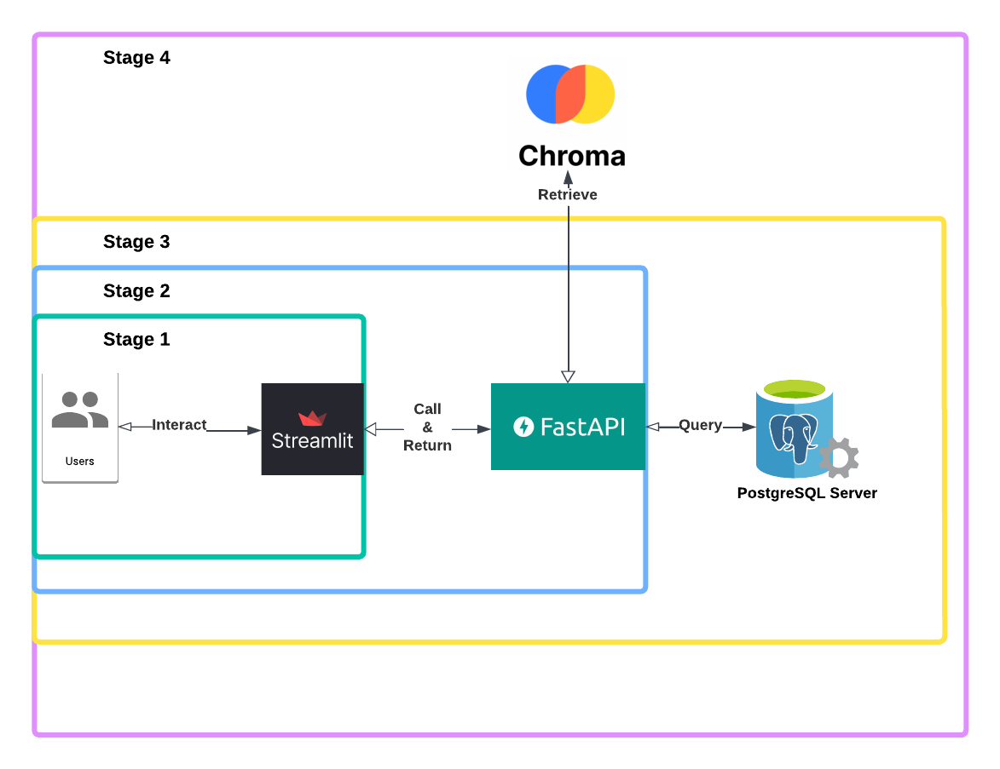
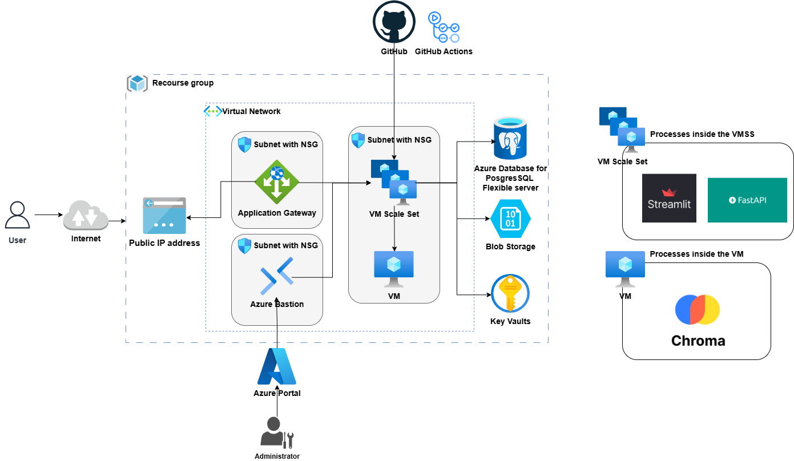

# Azure Infrastructure Deployment for RAG Chatbot using Terraform


## 📋 Prerequisites

  

- Azure Subscription

- Terraform installed

- Azure CLI authenticated to your account

  

----------

  

## ✨ Key Features

  

- Upload PDFs and ask document-specific questions

- Scalable and secure deployment on Azure

- Modularized Terraform setup

- End-to-end project showcasing cloud deployment of AI applications

  

----------
  

## 📖 Project Overview

  

This project deploys a **Retrieval-Augmented Generation (RAG) Chatbot** application on **Microsoft Azure** using **Terraform** for Infrastructure as Code (IaC).

  

The chatbot uses:

  

-  **Streamlit** for the user interface

-  **FastAPI** for handling backend logic

-  **ChromaDB** (Vector Store) for retrieving relevant information from user-uploaded PDFs

-  **PostgreSQL** for structured data storage

  

It enables users to chat normally **and** upload PDFs to ask questions specifically about the content of the uploaded documents, making the chatbot highly **context-aware** and **document-focused**.

  

## 💬 Application Architecture

  

A RAG (Retrieval-Augmented Generation) chatbot using **Streamlit** and **FastAPI**.

  

- At this stage, users can **upload PDF files** and **chat** normally.

- The system uses a **vector store (Chroma)** to retrieve the most relevant context from the PDFs.

- This allows the chatbot to **answer questions based on the document content**, not just the general conversation.

- It seamlessly integrates:

-  **Streamlit** for front-end interaction

-  **FastAPI** for backend processing

-  **PostgreSQL** for database storage

  

> ⚡ Note: While some LLM-related concepts (like vector search) are involved, the focus is to get the system running. Understanding every detail is optional.

  

### 📈 Application Data Flow Diagram

  

Here’s how the components interact:



## 🏗️ Cloud Infrastructure Architecture

  

To deploy the app in Azure, the architecture includes:

  

-  **Azure Virtual Network (VNet)** with multiple **subnets**.

-  **Application Gateway** to load balance and route user traffic.

-  **Azure Bastion** for secure management of VMs.

-  **VM Scale Sets** hosting Streamlit and FastAPI app.

-  **VM** hosting ChromaDB.

-  **PostgreSQL Database** service.

-  **Key Vault** for managing secrets (database passwords, API keys, etc.).

-  **Network Security Groups (NSGs)** for traffic filtering.

  

### 🖼️ Infrastructure Architecture Diagram

  

Here's the overall Azure infrastructure:



  

## 🚀 Deployment Steps

  

1. Clone this repository:

```
git clone https://github.com/your-username/your-repo-name.git

cd Chatbot-Project-Terraform
```

2. Generate ssh keys for VM:

```
mkdir -p ssh-keys

ssh-keygen -t rsa -b 4096 -f ssh-keys/terraform-azure -N ""

chmod 400 ssh-keys/terraform-azure
```

3. Generate ssh keys for VMSS:

```
ssh-keygen -t rsa -b 4096 -f ssh-keys/terraform-azure-vmss -N ""

chmod 400 ssh-keys/terraform-azure
```

4. Edit terraform.tfvars file:

```
subscription_id = "<YOUR_SUBSCRIPTION_ID>" #use your subsctiption Id

source_image_id = "<YOUR_IMAGE_ID>" # use your image for the VMSS

openai_key = "<YOUR_OPENAI_KEY>" # OpenAI_Key
```

> ⚡ Note: You can edit any variables name with name you likes.

5. Initialize Terraform:

```
terraform init
```

6. Plan Terraform:

```
terraform plan
```

7. Apply Terraform:

```
terraform apply --auto-approve

```

> ⚡ Note: --auto-approve is optional.


8. SSH to the Chroma VM using remote explorer with this configuration on it:

```
Host chromaVm # Name of the host, whatever name you like

HostName <PUBLIC_IP_ADDRESS_OF_THE_VM>

IdentityFile <PATH_TO_THE_PRIVATE_KEY>

User azureuser # the default is azureuser but change accordingly
```
9. After connecting to the VM, create a file name `setup.sh` and paste this script
 
	This script needs you to provide 7 arguments to the bash script:  

	1.  **PAT_token**: Your GitHub personal access token.
	2.  **repo_url**: The URL of your GitHub repository  **(without `https://`)**.
	3.  **branch_name**: The branch name to use on the VM.
	4.  **db_host**: The database host (e.g.,  `[dbteststage6.postgres.database.azure.com](http://dbteststage6.postgres.database.azure.com/)`).
	5.  **target_db**: The name of the database that was created.
	6.  **db_username**: The username for the database server.
	7.  **db_password**: The password for the database server.

To run the setup script:  
`bash setup.sh <PAT_token> <repo_url> <branch_name> <db_host> <target_db> <db_username> <db_password>` 
 
```bash 
#!/bin/bash

# Check if the correct number of arguments is provided
if [ $# -ne 7 ]; then
    echo "Usage: $0 <PAT_token> <repo_url> <branch_name> <db_host> <target_db> <db_username> <db_password>"
    exit 1
fi

# Assign arguments to variables
PAT_TOKEN="$1"
REPO_URL="$2"
BRANCH_NAME="$3"
DB_HOST="$4"
TARGET_DB="$5"
DB_USERNAME="$6"
DB_PASSWORD="$7"
REPO_NAME=$(basename "$REPO_URL" .git)
USER=$(whoami)
HOME_DIR=$(eval echo ~$USER)

# Set up PostgreSQL database
echo "Setting up database..."

# Step 2: Create the 'advanced_chats' table in the 'TARGET_DB' database
echo "Creating the 'advanced_chats' table in the $TARGET_DB database..."
psql "host=$DB_HOST port=5432 dbname=$TARGET_DB user=$DB_USERNAME password=$DB_PASSWORD sslmode=require" \
    -c "CREATE TABLE IF NOT EXISTS advanced_chats (
        id TEXT PRIMARY KEY,
        name TEXT NOT NULL,
        file_path TEXT NOT NULL,
        last_update TIMESTAMP DEFAULT CURRENT_TIMESTAMP,
        pdf_path TEXT,
        pdf_name TEXT,
        pdf_uuid TEXT
    );"

echo "Database and table setup completed successfully."

# Set up Conda environment
echo "Setting up conda environment..."
source "$HOME_DIR/miniconda3/etc/profile.d/conda.sh"
if ! conda env list | grep -q "^project "; then
    conda create -y -n project python=3.11
fi

# Clone the repository
echo "Cloning repository..."
cd "$HOME_DIR"
if [ -d "$REPO_NAME" ]; then
    echo "Directory $REPO_NAME already exists. Please remove it or choose a different repository."
    exit 1
fi
export GITHUB_TOKEN="$PAT_TOKEN"
git clone -b "$BRANCH_NAME" "https://${GITHUB_TOKEN}@${REPO_URL}"
if [ $? -ne 0 ]; then
    echo "Failed to clone repository"
    exit 1
fi
cd "$REPO_NAME"

# Install requirements
echo "Installing requirements..."
if [ -f requirements.txt ]; then
    "$HOME_DIR/miniconda3/envs/project/bin/pip" install -r requirements.txt
else
    echo "No requirements.txt found"
fi

# Create systemd services
echo "Creating systemd services..."
cat <<EOF | sudo tee /etc/systemd/system/chromadb.service
[Unit]
Description=ChromaDB
After=network.target

[Service]
Type=simple
User=$USER
WorkingDirectory=$HOME_DIR/$REPO_NAME
ExecStart=$HOME_DIR/miniconda3/envs/project/bin/chroma run --host 0.0.0.0 --path $HOME_DIR/$REPO_NAME/chroma_db
Restart=always

[Install]
WantedBy=multi-user.target
EOF

# Reload systemd and start services
echo "Reloading systemd and starting services..."
sudo systemctl daemon-reload
sudo systemctl enable chromadb
sudo systemctl start chromadb

echo "Setup completed successfully" 
  ``` 

10. Check if the chromadb service is running in host `0.0.0.0:8000` :

```bash
sudo systemctl status chromadb.service
```